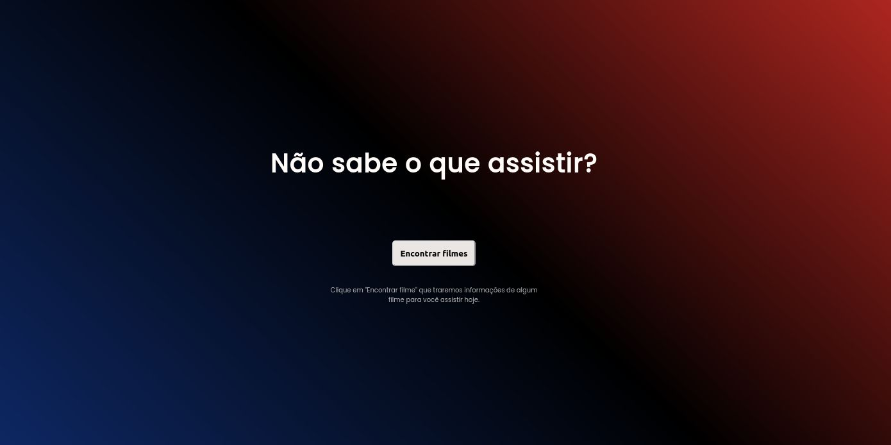

<h1 align="center"> Não sabe o que assistir? </h1>

 

## 🚀 Tecnologias

Esse projeto foi desenvolvido com as seguintes tecnologias:

- HTML e CSS
- JavaScript

 

 
<h3 align="center">Tela de recriação </h3>

 
  

 

<h3 align="center">Tela de recriação - 2 </h3>

 
  

 

<h3 align="center">Tela de recriação - 3 </h3>

 
  

 

 

## 💻 Projeto

O projeto é um desafio da **Rocketseat** e tem como objetivo a utilização da API do **The Movie Database**. Ao clicar no botão será gerado algum filme aleatório que está em alta recente. Conta com mais de 15 filmes.
